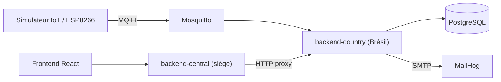

# FutureKawa – MSPR Bloc 4

Prototype de supervision du stockage de café : gestion des lots (FIFO), mesures de température et d'humidité via MQTT, alertes (hors plage, lot > 365 jours), notifications email et tableau de bord web.

## Architecture



| Dossier | Rôle | Port |
|---|---|---|
| `frontend/` | Dashboard React + Vite + Chart.js (servi par nginx) | 5173 |
| `backend-central/` | Agrégateur REST du siège, proxy vers les backends pays | 3000 |
| `backend-country/` | API REST + consumer MQTT + alertes + emails (Express, Prisma) | 3001 |
| `iot/simulator/` | Simulateur de capteur publiant sur MQTT | – |
| `Arduino/` | Sketch ESP8266 + DHT22 (capteur réel) | – |
| `infrastructure/` | Configuration Mosquitto et Jenkins | – |
| `e2e/` | Tests Playwright | – |
| `docs/` | Documentation détaillée | – |

Services Docker annexes : PostgreSQL (5432), Mosquitto (1883), MailHog (SMTP 1025, UI 8025), Jenkins (8080, profil `ci`).

## Stack

TypeScript, Node.js 22, Express, React 18, Vite, PostgreSQL 16, Prisma, Mosquitto, Nodemailer, Docker Compose, Vitest, Playwright, Jenkins.

## Démarrage rapide

Prérequis : Docker et Docker Compose.

```bash
docker compose up -d --build
docker compose ps
```

Le fichier `.env` à la racine fournit les variables PostgreSQL, MQTT et MailHog. Le backend pays applique les migrations Prisma au démarrage.

| Service | URL |
|---|---|
| Application web | http://localhost:5173 |
| API centrale | http://localhost:3000/api/countries |
| API pays (Brésil) | http://localhost:3001/api/lots |
| MailHog (emails d'alerte) | http://localhost:8025 |

Jenkins (optionnel) : `docker compose --profile ci up -d jenkins` (voir [docs/JENKINS.md](docs/JENKINS.md)).

### Développement local sans Docker

Chaque package (`backend-country`, `backend-central`, `frontend`) a son propre `package.json` et son `.env` local. Exemple :

```bash
cd backend-country
npm install
npx prisma generate
npm run dev
```

## Règles métier

**Seuils de stockage** (tolérance : ±3 °C, ±2 % d'humidité) :

| Pays | Code | Température | Humidité | État dans le code |
|---|---|---|---|---|
| Brésil | `BRA` | 29 °C (26–32) | 55 % (53–57) | Actif |
| Équateur | `ECU` | 31 °C | 60 % | Défini mais commenté |
| Colombie | `COL` | 26 °C | 80 % | Défini mais commenté |

- **FIFO** : `GET /api/lots` trie par `storageDate` croissante (lot le plus ancien en premier).
- **Alertes** `TEMPERATURE` et `HUMIDITY` : créées à la première mesure hors plage, sans doublon tant qu'elles sont actives, résolues automatiquement au retour dans la plage.
- **Expiration** : un lot stocké depuis plus de 365 jours passe en `EXPIRED` et déclenche une alerte `LOT_EXPIRED`. La vérification a lieu au démarrage puis toutes les heures.
- **Email** : un message est envoyé au responsable du pays à chaque nouvelle alerte (MailHog en local).

## API

### backend-central (`:3000`)

| Méthode | Route | Description |
|---|---|---|
| GET | `/health` | État du service |
| GET | `/api/countries` | Liste des pays configurés |
| GET | `/api/countries/:code/lots` | Lots du pays (FIFO) |
| POST | `/api/countries/:code/lots` | Création d'un lot |
| GET | `/api/countries/:code/lots/:lotId` | Détail d'un lot |
| GET | `/api/countries/:code/lots/:lotId/measurements` | Mesures depuis la date de stockage |
| GET | `/api/countries/:code/alerts` | Alertes (`?active=true` pour les actives) |

Un pays non configuré renvoie 404, un backend pays injoignable renvoie 503.

### backend-country (`:3001`)

| Méthode | Route | Description |
|---|---|---|
| GET | `/health` | État du service |
| GET / POST | `/api/lots` | Liste (FIFO) / création |
| GET | `/api/lots/:id` | Détail |
| GET | `/api/lots/:id/measurements` | Mesures de l'entrepôt du lot depuis `storageDate` |
| POST | `/api/lots/check-expiry` | Déclenche la vérification de péremption |
| GET | `/api/measurements` | Mesures (`warehouseId`, `limit` ≤ 1000) |
| GET | `/api/alerts` | Alertes (`?active=true`) |

### MQTT

- Topic : `futurekawa/brazil/<warehouseId>/measurements` (QoS 1)
- Payload :

```json
{ "warehouseId": "BR-WH-01", "countryCode": "BRA", "temperature": 29.4, "humidity": 55.1, "timestamp": "2026-10-06T10:00:00.000Z" }
```

## Tests

68 tests unitaires et d'intégration, plus 2 tests E2E.

| Package | Tests |
|---|---|
| `backend-country` | 37 |
| `backend-central` | 12 |
| `frontend` | 19 |

```bash
npm test                  # depuis la racine : les trois packages
npm run test:e2e          # Playwright (stack Docker requise, frontend sur :5173)
cd backend-country && npm run test:coverage
```

Détails : [docs/TESTS.md](docs/TESTS.md) et [docs/MANUAL_TESTS.md](docs/MANUAL_TESTS.md).

## CI/CD

Le `Jenkinsfile` enchaîne : Checkout, Install, Build, Tests (JUnit), Quality, Docker Build (4 images), Archive. Voir [docs/JENKINS.md](docs/JENKINS.md).

## Gestion multi-pays : état actuel

L'architecture est prête pour plusieurs pays, mais **seul le Brésil est actif**.

**Déjà générique** : routes du backend central (`/:countryCode/...`), tableau `COUNTRIES`, schéma Prisma avec `countryCode`, `checkAlerts` piloté par `COUNTRY_THRESHOLDS`, frontend dynamique (le sélecteur reflète `GET /api/countries`).

**À faire pour activer l'Équateur et la Colombie** :

1. Décommenter ECU et COL dans `backend-central/src/config/countries.ts`, `backend-country/src/config/thresholds.ts` et `backend-country/src/config/email.ts`.
2. Rendre le topic MQTT configurable dans `backend-country/src/mqttClient.ts` (actuellement `futurekawa/brazil/+/measurements`).
3. Paramétrer le simulateur (`iot/simulator/src/simulator.ts`) : pays, entrepôt, valeurs cibles et topic sont codés en dur pour le Brésil.
4. Dans `docker-compose.yml`, déployer une instance de `backend-country` par pays, chacune avec sa base, puis définir `ECUADOR_BACKEND_URL` et `COLOMBIA_BACKEND_URL` pour le backend central.
5. Remplacer l'entrepôt par défaut `BR-WH-01` dans `frontend/src/components/CreateLotForm.tsx`.

Les routes `lots`, `alerts` et `measurements` du backend pays ne filtrent pas par `countryCode` : il faut donc une instance et une base par pays.

## Limites connues

- Mosquitto autorise les connexions anonymes et le CORS du backend central est ouvert par défaut : configuration réservée au développement local.
- Le montage de `/var/run/docker.sock` dans Jenkins donne un accès complet au Docker de l'hôte (démonstration uniquement).
- Aucune authentification sur les API.
- Le sketch `Arduino/sketch_oct5a` contient des identifiants Wi-Fi et une IP de broker en clair : à remplacer avant tout partage du dépôt.
- Les comptes de tests dans `docs/TESTS.md` (63 tests) sont en retard sur le code (68 tests).

## Documentation

- [docs/TECHNICAL_DOCUMENTATION.md](docs/TECHNICAL_DOCUMENTATION.md) : architecture et choix techniques
- [docs/USER_GUIDE.md](docs/USER_GUIDE.md) : guide utilisateur
- [docs/alerting.md](docs/alerting.md) : mécanisme d'alertes et emails
- [docs/TESTS.md](docs/TESTS.md) et [docs/MANUAL_TESTS.md](docs/MANUAL_TESTS.md) : tests
- [docs/JENKINS.md](docs/JENKINS.md) : CI/CD
- [PROJECT.md](PROJECT.md) : cadrage du projet