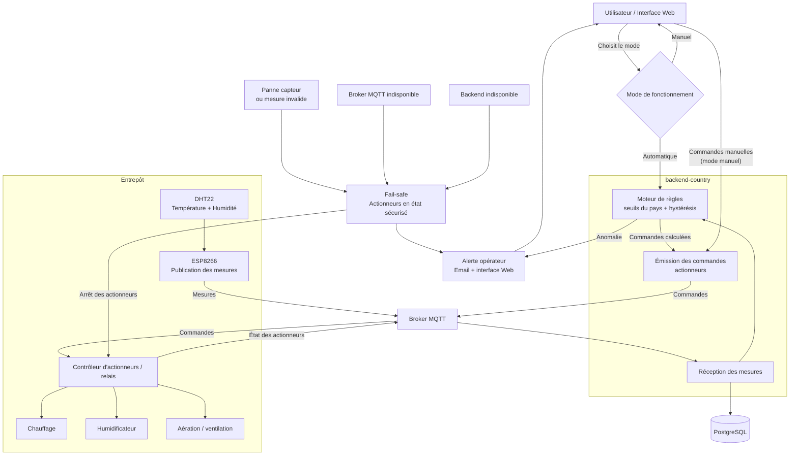

# FutureKawa — Phase 2 : automatisation des entrepôts

## 1. Objectif

La phase 2 vise à faire évoluer le système actuel de supervision vers une
automatisation partielle des conditions de stockage.

Le système existant mesure déjà :
- la température ;
- l'humidité ;
- l'entrepôt concerné ;
- le pays ;
- l'horodatage.

La future automatisation devra utiliser ces mesures pour piloter :

- le chauffage ;
- l'humidification ;
- l'aération.

L'objectif est de maintenir les conditions de stockage dans les plages
acceptables définies pour chaque pays, tout en conservant un contrôle humain.

---

## 2. Schéma de principe

---

## 3. Mode automatique

En mode automatique, les mesures reçues via MQTT sont comparées aux seuils
définis pour le pays.

Exemple pour le Brésil :

- température cible : 29 °C ;
- plage acceptable : 26 à 32 °C ;
- humidité cible : 55 % ;
- plage acceptable : 53 à 57 %.

Principe proposé :

| Situation | Action |
|---|---|
| Température < seuil minimum | Activation du chauffage |
| Température > seuil maximum | Activation de l'aération |
| Humidité < seuil minimum | Activation de l'humidification |
| Humidité > seuil maximum | Activation de l'aération |
| Conditions conformes | Aucun actionneur actif |

La logique devra intégrer une hystérésis afin d'éviter les démarrages et arrêts
répétés lorsqu'une valeur oscille autour d'un seuil.

## 4. Mode manuel

Le responsable d'entrepôt doit pouvoir désactiver l'automatisation et commander
manuellement les équipements.

Le passage en mode manuel doit :

- être visible dans l'application ;
- être historisé ;
- suspendre les décisions automatiques ;
- permettre le contrôle individuel des actionneurs.

Le système continue néanmoins à mesurer les conditions et à générer les alertes.

## 5. Sécurités

L'automatisation ne doit pas commander les équipements si la fiabilité des
mesures n'est pas garantie.

Les sécurités proposées sont :

- arrêt des actionneurs en cas de perte du capteur ;
- arrêt en cas de mesures invalides ou incohérentes ;
- durée maximale d'activation d'un actionneur ;
- impossibilité d'activer simultanément des équipements incompatibles ;
- possibilité de forcer un arrêt manuel ;
- alerte en cas de perte de communication MQTT ;
- conservation des alertes et événements dans les logs.

La stratégie retenue est un fonctionnement "fail-safe" :
en cas de doute, les équipements automatiques sont arrêtés et un opérateur est
prévenu.

## 6. Cas nominal

1. Le capteur mesure température et humidité.
2. Le microcontrôleur publie la mesure via MQTT.
3. Le backend pays reçoit et enregistre la mesure.
4. Le moteur de règles compare la mesure aux seuils.
5. Si les conditions sont conformes, aucune action n'est déclenchée.
6. Si une valeur sort de la plage acceptable, l'actionneur correspondant peut
   être activé.
7. Une nouvelle mesure permet de vérifier le retour à la normale.
8. L'actionneur est arrêté lorsque les conditions redeviennent conformes.

## 7. Cas dégradé

### Capteur indisponible

Le système :

- considère la mesure comme non fiable ;
- ne déclenche aucune nouvelle action automatique ;
- met les actionneurs dans leur état sécurisé ;
- génère une alerte.

### Broker MQTT indisponible

Le microcontrôleur tente une reconnexion.

Pendant l'indisponibilité :

- aucune décision automatique basée sur une nouvelle mesure n'est prise ;
- les équipements passent dans un état sûr ;
- une alerte technique est générée dès que possible.

### Backend indisponible

Les équipements ne doivent pas rester indéfiniment actifs sans supervision.
Une durée maximale d'activation doit donc être appliquée au niveau du
contrôleur local.

## 8. Intégration avec FutureKawa existant

La phase 2 réutilise l'architecture développée dans le prototype actuel :

DHT22 → ESP8266 → MQTT → backend-country → PostgreSQL → backend-central → frontend

Le futur module de décision sera intégré au backend pays ou dans un service
dédié.
Il exploitera les mêmes mesures MQTT et les mêmes seuils métier.
Aucune modification du mécanisme actuel de collecte et de traçabilité des
mesures n'est nécessaire pour réaliser cette évolution.

### Topics MQTT proposés pour les actionneurs

Les futures commandes pourraient utiliser des topics MQTT dédiés, distincts du
topic de mesures actuel :

| Usage | Topic proposé |
|---|---|
| Commandes vers le contrôleur d'actionneurs | `futurekawa/<pays>/<warehouseId>/commands` |
| État des actionneurs remonté au backend | `futurekawa/<pays>/<warehouseId>/actuators/status` |

Ces topics sont des **propositions d'architecture pour la phase 2**. Ils ne sont
**pas implémentés** dans le prototype actuel.

## 9. Limites du prototype

Ce schéma constitue une proposition d'architecture pour une future phase du
projet.
Les actionneurs physiques ne sont pas implémentés dans la MSPR actuelle.
Avant toute mise en production, une phase de cadrage métier et sécurité sera
nécessaire afin de déterminer notamment :

- les caractéristiques des équipements ;
- les temps maximum de fonctionnement ;
- les procédures d'urgence ;
- les responsabilités des opérateurs ;
- les contraintes réglementaires ;
- les scénarios acceptables d'automatisation.  