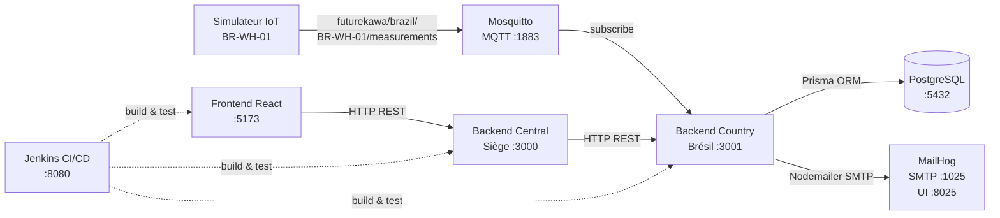
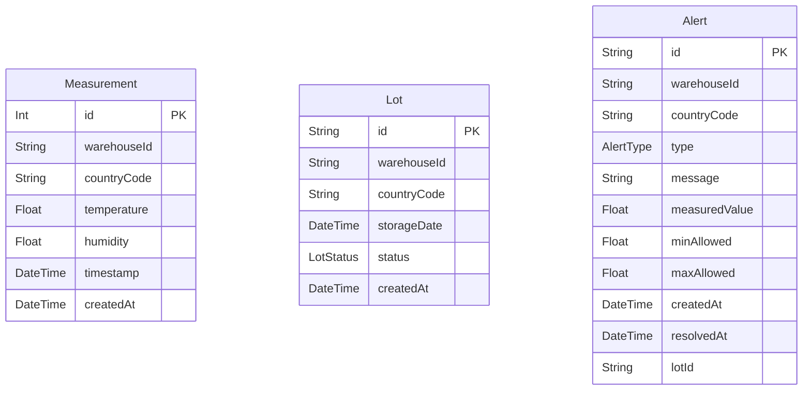
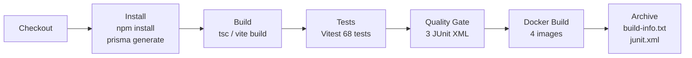

# Documentation Technique — FutureKawa MSPR Bloc 4

---

## 1. Introduction

FutureKawa est une plateforme de supervision du stockage du café dans les entrepôts des pays producteurs. Elle collecte en continu les données de température et d'humidité, détecte les écarts par rapport aux seuils définis, déclenche des alertes et notifie les responsables par email.

**Prototype actuel :** le Brésil est entièrement implémenté comme pays pilote (entrepôt `BR-WH-01`).

### Vue d'ensemble du flux

```
Capteur IoT / Simulateur
        │ MQTT
        ▼
   Mosquitto Broker
        │
        ▼
  Backend Brésil ──► PostgreSQL
        │
        │ REST
        ▼
  Backend Central (siège)
        │
        │ REST
        ▼
  Frontend React
```

L'architecture est conçue pour être étendue à d'autres pays producteurs (Équateur, Colombie…) sans modifier les composants existants.

---

## 2. Architecture générale

### Diagramme des composants



### Rôle de chaque composant

| Composant | Technologie | Rôle |
|-----------|-------------|------|
| iot-simulator | Node.js / TypeScript | Publie une mesure toutes les 10 s sur le broker MQTT |
| mosquitto | Eclipse Mosquitto 2 | Broker MQTT — point de collecte des mesures IoT |
| backend-country | Node.js / Express / TypeScript / Prisma | Backend local Brésil : persistance, alertes, API REST |
| postgres | PostgreSQL 16 | Base de données des mesures, lots et alertes du Brésil |
| mailhog | MailHog | Serveur SMTP de test — capture les emails d'alerte |
| backend-central | Node.js / Express / TypeScript | Proxy REST du siège — abstraction multi-pays |
| frontend | React 18 / Vite / TypeScript | Interface web de supervision |
| jenkins | Jenkins LTS | Pipeline CI/CD — tests automatisés et build Docker |

---

## 3. Choix d'architecture distribuée

### Principe

Chaque pays producteur dispose de son propre backend local colocalisé avec son entrepôt. Ce backend gère :

- la réception des mesures IoT via MQTT,
- la persistance dans une base PostgreSQL locale,
- la détection des anomalies selon les seuils propres au pays,
- l'exposition d'une API REST consommée par le siège.

Le backend central (siège) n'accède **jamais directement** à PostgreSQL. Il interroge uniquement les API REST des backends pays et fait proxy vers le frontend.

### Avantages

| Avantage | Explication |
|----------|-------------|
| **Découplage** | Un pays peut être hors ligne sans impacter les autres |
| **Indépendance** | Chaque pays peut avoir ses propres seuils, sa base, son réseau |
| **Résilience** | Le siège retourne HTTP 503 propre si un pays est indisponible |
| **Extensibilité** | Ajouter un pays = déployer un backend + enregistrer son URL dans backend-central |
| **Supervision centralisée** | Le frontend n'a qu'un seul point d'entrée : backend-central |

---

## 4. Backend pays — Brésil

### Stack technique

| Composant | Version |
|-----------|---------|
| Node.js | 22.x |
| Express | 5.x |
| TypeScript | 5.x |
| Prisma ORM | 6.x |
| PostgreSQL | 16 |
| MQTT.js | 5.x |
| Nodemailer | 6.x |

### Responsabilités

1. **Réception MQTT** : abonnement au topic `futurekawa/brazil/+/measurements`, validation et persistance de chaque mesure.
2. **Gestion des lots** : création, consultation, tri FIFO par `storageDate`, détection d'expiration.
3. **Détection d'alertes** : comparaison des mesures aux seuils Brésil après chaque réception.
4. **Non-duplication** : une seule alerte active par type et par entrepôt à la fois.
5. **Expiration des lots** : détection des lots stockés depuis plus de 365 jours (`POST /api/lots/check-expiry`).
6. **Notifications email** : envoi via Nodemailer/SMTP à chaque nouvelle alerte.

---

## 5. API backend-country

**Base URL :** `http://localhost:3001`

| Méthode | Endpoint | Description | Réponse principale |
|---------|----------|-------------|-------------------|
| `GET` | `/health` | Statut du service | `{ status: "ok", service: "backend-country" }` |
| `GET` | `/api/measurements` | Dernières mesures (défaut 100, max 1000) | `{ data: [...], count }` |
| `GET` | `/api/lots` | Tous les lots triés FIFO | `{ data: [...], count }` |
| `POST` | `/api/lots` | Créer un lot | `201` + lot créé |
| `POST` | `/api/lots/check-expiry` | Déclencher la vérification d'expiration | `{ message, expiredCount }` |
| `GET` | `/api/lots/:id` | Détail d'un lot | Objet lot ou `404` |
| `GET` | `/api/lots/:id/measurements` | Mesures du lot (filtrées par entrepôt + storageDate) | `{ lotId, warehouseId, storageDate, data, count }` |
| `GET` | `/api/alerts` | Toutes les alertes (param `?active=true`) | `{ data: [...], count }` |

**Paramètres notables :**
- `GET /api/measurements?warehouseId=BR-WH-01&limit=50` — filtrage et pagination
- `GET /api/alerts?active=true` — alertes non résolues uniquement

---

## 6. Gestion des lots et FIFO

### Modèle Lot

| Champ | Type | Description |
|-------|------|-------------|
| `id` | `String` (CUID) | Identifiant unique généré automatiquement |
| `warehouseId` | `String` | Identifiant de l'entrepôt (ex. `BR-WH-01`) |
| `countryCode` | `String` | Code pays ISO alpha-3 (ex. `BRA`) |
| `storageDate` | `DateTime` | **Date métier** d'entrée en stockage (fournie par l'utilisateur) |
| `status` | `Enum` | `COMPLIANT` / `ALERT` / `EXPIRED` |
| `createdAt` | `DateTime` | Date technique de création de l'enregistrement |

> **Important :** `storageDate` est la date de début de stockage du café — c'est cette date qui détermine l'ordre FIFO et l'ancienneté du lot. `createdAt` est uniquement la date d'insertion en base.

### Principe FIFO

```sql
ORDER BY storageDate ASC
```

Le lot ayant la `storageDate` la plus ancienne apparaît en premier. C'est lui qui doit être traité ou expédié en priorité.

---

## 7. Historique des mesures d'un lot

Il n'existe pas de clé étrangère directe entre `Measurement` et `Lot`. La liaison est faite par filtre :

```
Measurement.warehouseId == Lot.warehouseId
ET
Measurement.timestamp >= Lot.storageDate
```

Cela signifie que toutes les mesures de l'entrepôt `BR-WH-01` reçues **depuis la date de stockage du lot** sont considérées comme appartenant à ce lot. Ce choix architectural simplifie la collecte MQTT (pas besoin de référencer le lot dans chaque message IoT).

---

## 8. MQTT

### Configuration

| Paramètre | Valeur |
|-----------|--------|
| Broker | Eclipse Mosquitto 2 |
| Port | 1883 |
| Topic souscrit | `futurekawa/brazil/+/measurements` |
| Topic publié (simulateur) | `futurekawa/brazil/BR-WH-01/measurements` |
| QoS | 1 |

> Le `+` dans le topic souscrit est un wildcard single-level MQTT : il correspond à n'importe quel identifiant d'entrepôt brésilien.

### Structure du payload

```json
{
  "warehouseId": "BR-WH-01",
  "countryCode": "BRA",
  "temperature": 29.0,
  "humidity": 55.0,
  "timestamp": "2026-08-13T14:30:00.000Z"
}
```

| Champ | Type | Description |
|-------|------|-------------|
| `warehouseId` | `string` | Identifiant de l'entrepôt source |
| `countryCode` | `string` | Code pays ISO alpha-3 |
| `temperature` | `number` | Température en degrés Celsius |
| `humidity` | `number` | Humidité relative en % |
| `timestamp` | `string` | Horodatage ISO 8601 UTC de la mesure |

Tout message avec un payload invalide ou des champs manquants est ignoré avec une trace d'erreur.

---

## 9. Seuils Brésil

Les seuils sont définis dans `backend-country/src/config/thresholds.ts` :

```typescript
BRA: {
  temperature: { target: 29, tolerance: 3 },  // plage : 26–32°C
  humidity:    { target: 55, tolerance: 2 },   // plage : 53–57%
}
```

### Règles de détection

| Type | Condition de déclenchement |
|------|---------------------------|
| `TEMPERATURE` | `temperature < 26` ou `temperature > 32` |
| `HUMIDITY` | `humidity < 53` ou `humidity > 57` |

Ces seuils s'appliquent uniquement au pays `BRA`. Pour un autre pays, il suffit d'ajouter son entrée dans `COUNTRY_THRESHOLDS`. Si aucun seuil n'est configuré pour un `countryCode`, les alertes sont ignorées silencieusement.

---

## 10. Cycle de vie des alertes

### États

```
AUCUNE ALERTE
    │
    │ mesure hors seuil
    │ + aucune alerte active du même type
    ▼
ALERTE ACTIVE (resolvedAt = null)
    │
    │ mesure revenue dans la plage
    ▼
ALERTE RÉSOLUE (resolvedAt = horodatage)
```

### Champs du modèle Alert

| Champ | Type | Description |
|-------|------|-------------|
| `id` | `String` (CUID) | Identifiant unique |
| `warehouseId` | `String` | Entrepôt concerné |
| `countryCode` | `String` | Pays concerné |
| `type` | `Enum` | `TEMPERATURE` / `HUMIDITY` / `LOT_EXPIRED` |
| `message` | `String` | Description lisible (ex. "Température hors plage acceptable") |
| `measuredValue` | `Float` | Valeur mesurée ayant déclenché l'alerte |
| `minAllowed` | `Float` | Borne inférieure acceptable |
| `maxAllowed` | `Float` | Borne supérieure acceptable |
| `createdAt` | `DateTime` | Date de création |
| `resolvedAt` | `DateTime?` | Date de résolution — `null` si toujours active |
| `lotId` | `String?` | Renseigné uniquement pour `LOT_EXPIRED` |

### Stratégie de non-duplication

Avant de créer une alerte, le service vérifie :

```typescript
findFirst({ where: { warehouseId, type, resolvedAt: null } })
```

- Si une alerte active du même type existe pour cet entrepôt → **aucune nouvelle alerte créée**.
- Si la valeur revient dans la plage → l'alerte active est **résolue** (`resolvedAt = now()`).
- Si la valeur repasse hors plage après résolution → **une nouvelle alerte est créée**.

---

## 11. Expiration des lots

### Règle

Un lot est considéré expiré si :

```
now() - storageDate > 365 jours (strictement)
```

### Endpoint

```
POST /api/lots/check-expiry
```

**Comportement :**
1. Recherche tous les lots non encore `EXPIRED` dont la `storageDate` est antérieure à la date de coupure.
2. Met à jour leur statut à `EXPIRED`.
3. Crée une alerte `LOT_EXPIRED` **uniquement si aucune alerte de ce type n'existe déjà pour ce lot** (vérification par `lotId`).

**Idempotence :** appeler l'endpoint une deuxième fois sur les mêmes lots retourne `expiredCount = 0` — aucun doublon n'est créé.

**Réponse :**
```json
{ "message": "Vérification effectuée.", "expiredCount": 2 }
```

---

## 12. Email

### Configuration

| Paramètre | Valeur |
|-----------|--------|
| Client | Nodemailer |
| SMTP host | `mailhog` (variable `SMTP_HOST`) |
| SMTP port | `1025` (variable `SMTP_PORT`) |
| Expéditeur | `alerts@futurekawa.local` (variable `MAIL_FROM`) |
| Destinataire BRA | `responsable.bresil@futurekawa.local` (variable `BRAZIL_MANAGER_EMAIL`) |
| Interface web | http://localhost:8025 |

MailHog intercepte tous les emails sans les envoyer sur Internet : c'est un serveur SMTP factice adapté aux environnements de développement et de démonstration.

**Comportement en cas d'échec SMTP :** si l'envoi échoue (exception Nodemailer), l'erreur est journalisée mais **ne bloque pas** l'enregistrement de la mesure ni la création de l'alerte en base. La donnée métier est toujours persistée.

Un email est envoyé à chaque **nouvelle** alerte créée (pas lors de la résolution ni des doublons évités).

---

## 13. Backend central

### Caractéristiques

- **Stateless** — pas de base de données.
- **Proxy REST** — transfère les requêtes du frontend vers le backend pays approprié.
- Le frontend ne connaît jamais l'adresse des backends pays.
- L'abstraction se fait par `countryCode` (clé de lookup dans la configuration).

### Lookup pays

La configuration `backend-central/src/config/countries.ts` fait le lien entre `countryCode` et l'URL du backend pays :

```typescript
COUNTRIES = [
  { code: 'BRA', name: 'Brésil', backendUrl: process.env.BRAZIL_BACKEND_URL }
]
```

### API backend-central

**Base URL :** `http://localhost:3000`

| Méthode | Endpoint | Description |
|---------|----------|-------------|
| `GET` | `/health` | Statut du service central |
| `GET` | `/api/countries` | Liste des pays configurés |
| `GET` | `/api/countries/:cc/lots` | Lots du pays (proxy → backend-country) |
| `POST` | `/api/countries/:cc/lots` | Créer un lot (proxy) |
| `GET` | `/api/countries/:cc/lots/:id` | Détail d'un lot (proxy) |
| `GET` | `/api/countries/:cc/lots/:id/measurements` | Mesures d'un lot (proxy) |
| `GET` | `/api/countries/:cc/alerts` | Alertes du pays, param `?active=true` (proxy) |

---

## 14. Gestion des erreurs et résilience

### Codes d'erreur normalisés

| Cas | Code HTTP | Corps |
|-----|-----------|-------|
| Pays non configuré | 404 | `{ "error": "Pays non configuré" }` |
| Backend pays inaccessible | 503 | `{ "error": "Backend pays indisponible", "countryCode": "BRA" }` |
| Lot introuvable | 404 | `{ "error": "Lot « id » introuvable." }` |
| Corps JSON invalide (POST) | 400 | `{ "error": "message de validation" }` |
| Doublon d'identifiant | 409 | `{ "error": "Un lot avec cet identifiant existe déjà." }` |

### Résilience backend-central

```
Frontend
    │
    ▼
Backend Central ✅  ──►  /health → 200 OK
    │
    ▼
Backend Country ❌  (conteneur arrêté)
    │
    ▼
HTTP 503 {"error": "Backend pays indisponible", "countryCode": "BRA"}
```

Le backend central reste disponible et répond à `/health` même si tous les backends pays sont arrêtés.

---

## 15. Frontend

### Stack technique

| Composant | Version |
|-----------|---------|
| React | 18.3 |
| Vite | 6.x |
| TypeScript | 5.x |
| Chart.js | 4.4 |
| react-chartjs-2 | 5.2 |

### Composants principaux

| Composant | Rôle |
|-----------|------|
| `CountrySelector` | Sélection du pays (Brésil dans le prototype) |
| `SummaryCards` | Cartes de synthèse : total lots, conformes, expirés, alertes actives |
| `LotsTable` | Tableau des lots triés FIFO, avec badges de statut |
| `LotDetails` | Affichage du détail d'un lot sélectionné |
| `MeasurementsCharts` | Graphiques `Line` température et humidité (Chart.js) |
| `AlertsPanel` | Liste des alertes actives avec type, valeur mesurée et entrepôt |
| `CreateLotForm` | Formulaire modal de création de lot |

### Flux principal

1. Au démarrage : `GET /api/countries` → sélection automatique du premier pays.
2. Changement de pays : `GET /api/countries/BRA/lots` + `GET /api/countries/BRA/alerts?active=true`.
3. Clic sur un lot : `GET /api/countries/BRA/lots/:id/measurements`.
4. Actualisation manuelle ou auto-refresh toutes les 10 secondes.

Le frontend communique **exclusivement** avec `http://localhost:3000` (backend-central). L'URL est configurable via `VITE_API_BASE_URL` au moment du build.

---

## 16. Base de données

### Diagramme ER



> Il n'y a **pas de clé étrangère** entre `Measurement` et `Lot` (liaison logique par `warehouseId` + `timestamp >= storageDate`).  
> `Alert.lotId` est une référence logique vers `Lot.id` — non contrainte en base — renseignée uniquement pour les alertes `LOT_EXPIRED`.

### Index Prisma

| Modèle | Index |
|--------|-------|
| Measurement | `warehouseId`, `timestamp` |
| Lot | `storageDate`, `warehouseId` |
| Alert | `(warehouseId, type, resolvedAt)`, `(lotId, type)` |

---

## 17. Docker

### Services et ports

| Service | Conteneur | Port(s) | Rôle |
|---------|-----------|---------|------|
| postgres | futurekawa_postgres | 5432 | Base de données |
| mosquitto | futurekawa_mosquitto | 1883 | Broker MQTT |
| mailhog | futurekawa_mailhog | 1025 (SMTP), 8025 (UI) | Serveur email de test |
| backend-country | futurekawa_backend_country | 3001 | API REST Brésil |
| backend-central | futurekawa_backend_central | 3000 | API REST siège |
| frontend | futurekawa_frontend | 5173 | Interface web |
| iot-simulator | futurekawa_iot_simulator | — | Simulation capteurs IoT |
| jenkins | futurekawa_jenkins | 8080, 50000 | CI/CD (profil `ci`) |

### Démarrage

```powershell
# Stack complète (hors Jenkins)
docker compose up -d

# Vérifier l'état
docker compose ps

# Avec Jenkins CI/CD
docker compose --profile ci up -d jenkins
```

**Critère de santé :** PostgreSQL doit afficher `(healthy)` avant que les backends démarrent (health check configuré).

### Persistance

Les données sont conservées dans des volumes Docker nommés :

| Volume | Contenu |
|--------|---------|
| `postgres_data` | Base PostgreSQL |
| `mosquitto_data` | Données Mosquitto |
| `jenkins_home` | Configuration et historique Jenkins |

---

## 18. Simulateur IoT

Le simulateur (`iot/simulator`) remplace le matériel physique pendant le développement.

### Comportement

- **Topic publié :** `futurekawa/brazil/BR-WH-01/measurements`
- **Intervalle :** toutes les 10 secondes (configurable via `INTERVAL_MS`)
- **Modèle de données :** marche aléatoire avec rappel vers la cible (mean-reversion) :
  - Température : cible 29°C, bruit ±0.6°C par pas, bornes 24–34°C
  - Humidité : cible 55%, bruit ±0.5% par pas, bornes 50–60%

Ces bornes larges (±5°C / ±5%) permettent de générer occasionnellement des valeurs hors seuil acceptables (±3°C / ±2%), déclenchant et résolvant des alertes de façon réaliste.

### Remplacement par le matériel réel

Lors de la réception des capteurs physiques, le simulateur sera remplacé par un microcontrôleur (ex. ESP32) connecté à des capteurs de température et d'humidité. Le topic MQTT et le format JSON seront conservés :

```
Microcontrôleur + capteur
         │ MQTT
         ▼
    Mosquitto :1883
         │
         ▼
  backend-country (inchangé)
  PostgreSQL (inchangé)
  backend-central (inchangé)
  frontend (inchangé)
```

Seul le simulateur est remplacé — aucun changement côté backend ni frontend.

---

## 19. Tests automatisés

### Résumé

| Catégorie | Fichiers | Tests | Outils |
|-----------|----------|-------|--------|
| Unitaires / API — backend-country | 6 | 37 | Vitest + Supertest |
| Unitaires / API — backend-central | 1 | 12 | Vitest + Supertest |
| Composants React — frontend | 6 | 19 | Vitest + React Testing Library |
| **Total tests automatisés** | **13** | **68** | |
| E2E — navigation et création | 2 | 2 | Playwright + Chromium |
| **Total général** | **15** | **70** | |

### Types de tests

**Unitaires (fonctions pures) :** validation des seuils (`getRange`), détection d'expiration (`isLotExpired`).

**Tests API / intégration :** Supertest sur l'application Express avec Prisma et httpClient mockés via `vi.mock`. Couvrent les cas nominaux, les erreurs 400/404/409/503.

**Tests composants React :** React Testing Library + jsdom. Tous les services API et Chart.js sont mockés. Couvrent le rendu, les interactions utilisateur (clic, saisie, soumission), les cas limites (liste vide).

**Tests E2E Playwright :** nécessitent le stack Docker complet. Testent la navigation pays→lots et la création d'un lot via l'interface.

### Lancement

```powershell
# backend-country (37 tests)
cd backend-country && npm test

# backend-central (12 tests)
cd backend-central && npm test

# frontend (19 tests)
cd frontend && npm test

# E2E (stack Docker requise + Vite sur :5173)
npx playwright test
```

---

## 20. Tests manuels

Un plan de tests manuels complet est disponible dans [docs/MANUAL_TESTS.md](MANUAL_TESTS.md).

Il documente 20 scénarios reproductibles couvrant :

| Scénario | Référence |
|----------|-----------|
| Démarrage de l'environnement | MT-01 |
| Health checks API | MT-02, MT-03 |
| Consultation des lots FIFO | MT-04, MT-05, MT-06 |
| Historique des mesures d'un lot | MT-07 |
| Publication MQTT manuelle | MT-08 |
| Création, non-duplication et résolution d'alertes | MT-09, MT-10, MT-11 |
| Alerte température | MT-12 |
| Emails MailHog | MT-13 |
| Expiration et idempotence | MT-14 |
| Erreur 404 pays inconnu | MT-15 |
| Résilience HTTP 503 | MT-16 |
| Frontend — tableau de bord, graphiques, création | MT-17 à MT-20 |

---

## 21. CI/CD Jenkins

### Pipeline (7 stages)



Chaque stage est parallélisé sur les 3 composants (backend-country, backend-central, frontend). **Le pipeline échoue immédiatement si une étape échoue.**

### Résultats (build #7)

| Stage | Résultat | Durée |
|-------|----------|-------|
| Checkout | ✅ | ~10 s |
| Install | ✅ | ~45 s |
| Build | ✅ | ~30 s |
| Tests (68 tests) | ✅ | ~20 s |
| Quality Gate | ✅ | ~3 s |
| Docker Build (× 4) | ✅ | ~3 min |
| Archive | ✅ | ~5 s |

### Images Docker produites

| Image | Tag | Taille |
|-------|-----|--------|
| `futurekawa/backend-country` | `BUILD_NUMBER` | ~907 MB |
| `futurekawa/backend-central` | `BUILD_NUMBER` | ~338 MB |
| `futurekawa/frontend` | `BUILD_NUMBER` | ~93 MB |
| `futurekawa/iot-simulator` | `BUILD_NUMBER` | ~258 MB |

### Rapports JUnit

Les rapports XML (format JUnit) sont publiés dans Jenkins UI après chaque build :

```
http://localhost:8080/job/futurekawa/lastBuild/testReport/
```

### Déclenchement

Le pipeline est déclenché **manuellement** depuis l'interface Jenkins. La configuration d'un webhook GitHub automatique n'est pas incluse dans le prototype actuel.

---

## 22. Sécurité et limites du prototype

Cette section présente honnêtement les limites connues du prototype dans le contexte d'une démonstration MSPR.

| Limite | Description |
|--------|-------------|
| **Pas d'authentification** | L'API REST et l'interface web ne requièrent aucune authentification |
| **MQTT sans TLS** | Le broker Mosquitto fonctionne en clair sur le port 1883 |
| **Secrets en clair** | Les mots de passe et URL sont dans `.env` et `docker-compose.yml` (configuration de démonstration) |
| **MailHog** | Serveur SMTP factice — les emails ne sont pas réellement envoyés |
| **Un seul pays** | Seul le Brésil est entièrement implémenté |
| **Un seul entrepôt** | Le simulateur IoT ne couvre que `BR-WH-01` |
| **Simulateur** | Les données IoT sont simulées en attendant le matériel physique |

Ces points constituent des évolutions naturelles vers une version de production, non des défauts du prototype.

---

## 23. Extensibilité multi-pays

Pour ajouter un nouveau pays (ex. Équateur `ECU`) sans modifier le code existant :

1. **Déployer** un backend-country + PostgreSQL + Mosquitto locaux en Équateur.
2. **Définir les seuils** dans `backend-country/src/config/thresholds.ts` :
   ```typescript
   ECU: { temperature: { target: 31, tolerance: 3 }, humidity: { target: 60, tolerance: 2 } }
   ```
3. **Configurer l'URL** dans `backend-central/src/config/countries.ts` :
   ```typescript
   { code: 'ECU', name: 'Équateur', backendUrl: process.env.ECUADOR_BACKEND_URL }
   ```
4. **Ajouter l'email** du responsable dans `backend-country/src/config/email.ts` :
   ```typescript
   ECU: process.env.ECUADOR_MANAGER_EMAIL
   ```
5. **Déployer** la nouvelle configuration sur Docker Compose (ou orchestrateur).
6. **Résultat :** le frontend affiche automatiquement l'Équateur dans le sélecteur de pays et peut interroger ses lots, mesures et alertes via backend-central.

Les commentaires dans le code indiquent déjà les entrées ECU et COL prévues.

---

## 24. Conclusion

Le prototype FutureKawa implémente une architecture distribuée complète et opérationnelle pour la supervision du stockage du café :

- **Architecture distribuée** : chaque pays producteur gère ses données localement ; le siège supervise via un proxy REST centralisé.
- **Prototype Brésil opérationnel** : collecte IoT via MQTT, persistance PostgreSQL, alertes en temps réel, notifications email, interface de supervision React.
- **Qualité** : 70 tests automatisés (68 unitaires + 2 E2E) avec rapports JUnit dans Jenkins ; pipeline CI/CD complet en 7 stages.
- **Extensibilité** : ajouter un pays ne nécessite que la configuration de son URL et de ses seuils — aucun changement architectural.
- **Préparation matérielle** : le simulateur IoT sera remplacé par le matériel réel sans modifier le reste de la stack.

La plateforme est prête pour la démonstration MSPR et fournit les bases d'une mise en production progressive par pays.
